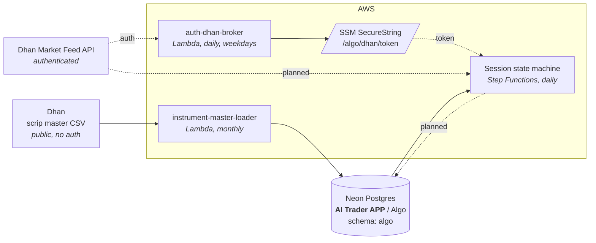

# Architecture

← [Back to root README](../README.md) · [Flow charts](flow.md) · [Components](components.md)

## System context

This repo is the **data layer** of an Indian-index algo trading system, rebuilt
on AWS Lambda. It does not place orders. Its job is to keep a correct,
replayable picture of the market in Postgres so that the decision layers above
it have something deterministic to read.

Two planes run on different clocks and are deliberately **not** coupled:

| Plane | Cadence | Trigger | Status |
|---|---|---|---|
| Instrument master refresh | monthly | EventBridge Scheduler cron | **built** |
| Broker token refresh | daily, weekdays 08:00 | EventBridge Scheduler cron | **built** |
| Daily candles + daily read | daily, weekdays 09:50 | EventBridge Scheduler cron | **built** |
| Intraday candles | every 5 min, 10:00–15:35 | EventBridge Scheduler cron | **built**, schedules pending |

**No Step Functions state machine was built.** An earlier design had one
sequencing History → Regime → Strategy; what exists instead is a set of
independently scheduled Lambdas, each on its own clock. That keeps failure
domains separate — a bad token refresh raises its own alarm rather than failing
a session — and it removed the plane where secrets would have travelled as step
output.

## Why secrets live in SSM

`auth-dhan-broker` writes the token to an SSM `SecureString` rather than
handing it to consumers directly. The original reason was Step Functions: it
records the input and output of every state in its execution history, readable
through `GetExecutionHistory` and retained for around 90 days with no
field-level redaction — a token passed that way would sit in plaintext where a
token in SSM sits behind `ssm:GetParameter` plus `kms:Decrypt`.

The state machine was never built, but the pattern earned its place anyway and
now covers three parameters:

| Parameter | Written by | Read by |
|---|---|---|
| `/algo/dhan/token` | `auth-dhan-broker` | `daily-market-sentiment`, `intraday-data-loader` |
| `/algo/telegram/brief` | by hand | `daily-market-sentiment` |
| `/algo/neon/connection` | by hand | every function that touches Neon |

The last one replaced a `NEON_CONNECTION_STRING` environment variable
duplicated across functions. Environment variables are encrypted at rest but
readable by anyone holding `lambda:GetFunctionConfiguration`, and rotating the
database password meant editing every function that carried it. One parameter,
one edit.

Each function keeps an environment-variable override for local testing, and
logs which source it used — so a stale variable cannot quietly shadow a rotated
parameter.

## Why the loader sits outside the state machine

The instrument master is reference data, not session data. It changes when the
exchange lists or expires contracts — roughly monthly — while the state machine
runs per trading day. Coupling them would mean either re-fetching a 25 MB CSV
every morning or letting a slow, rarely-needed step sit on the critical path of
every session.

The monthly cadence is inherited from `should_load_instrument_master()` in the
legacy `trading-algo/data/database_service.py`, which reloads whenever no row
carries `updated_at >=` the first of the current month.

## Data store

**Neon project `AI Trader APP`** (`nameless-mountain-15353651`), database
`Algo`, schema `algo`. Neon is serverless Postgres — the compute autosuspends
when idle, which is a good fit for workloads that run monthly or once a day, at
the cost of a wake-up on the first connection of each run.

| Table | Shape | Rows | Written by |
|---|---|---|---|
| `instrument_master` | `security_id, trading_symbol, exchange_segment, instrument_type, lot_units, updated_at` | 15,463 | instrument-master-loader |
| `candle_daily` | `security_id, instrument_type, candle_ts, open, high, low, close, volume` | 408 | daily-market-sentiment |
| `daily_market_sentiment` | 26 columns — bias, regime, score, the SMA/RSI inputs, VIX-implied expected move | 1 | daily-market-sentiment |
| `candle_5min` | same shape as `candle_daily` | 8,775 | intraday-data-loader |
| `candle_15min` | same | 2,925 | intraday-data-loader |
| `candle_1hr` | same | 819 | intraday-data-loader |

Row counts as of 2026-09-11. `candle_daily` holds 204 NIFTY and 204 INDIA VIX
candles from the cold start. The intraday tables hold NIFTY and
NIFTY-SEP2026-FUT over a 90-day window — exactly 75 five-minute, 25
fifteen-minute and 7 hourly bars per session, with no misaligned rows.

The intraday tables hold **one partial bar each while the session is open** —
Dhan returns the in-progress bucket and the loader stores it, correcting it by
primary key on a later pass. A reader tells a closed bar from a forming one with
`candle_ts + interval_seconds <= now`; everything older than the newest bar is
final, so replay is unaffected.

**`security_id` alone is not an identity.** 19 security_ids carry more than one
`instrument_type` — `13` is both NIFTY (`IDX_I`/`INDEX`) and ABB
(`NSE_EQ`/`EQUITY`). A lookup missing the `instrument_type` silently resolved to
ABB on 2026-09-11 and wrote 204 ABB candles labelled NIFTY. Always query on the
pair.

## Invariants

These hold across the whole system and are the reason it is built this way.

1. **Every time value is epoch seconds.** `updated_at`, `candle_ts`, and every
   timestamp added later. No `timestamptz` columns, no timezone arithmetic in
   SQL. Display conversion to IST happens at the edge, never in storage.
2. **`exchange_segment` is the raw Dhan segment code** — `NSE_EQ`, `IDX_I`,
   `NSE_FNO`, `BSE_FNO` — never a human-readable string. Downstream code passes
   it straight back to the broker API.
3. **`(security_id, instrument_type)` identifies an instrument.** It is the
   primary key of `instrument_master` and the join key used by the candle
   tables. `security_id` is `text`, not an integer, deliberately.
4. **The trading system is fully deterministic and replayable.** Given the same
   stored data it reaches the same decisions. Any LLM in the loop reads from
   this store and never writes a decision into it.

## Deployment shape

Everything is a **zip-packaged Lambda with a pure-Python layer** — no container
images, no Docker build.

An earlier iteration moved to containerised ECS Fargate tasks on the grounds
that pandas, psycopg2 and the `dhanhq` SDK do not fit Lambda's packaging
limits. That was abandoned: the packages turned out to be avoidable rather than
mandatory. The scrip master is a public CSV parseable with stdlib `csv`, and
[pg8000](../layers/neon-db-driver/README.md) is a pure-Python Postgres driver.
Dropping those three dependencies removed the reason to leave Lambda.

The rule that keeps it that way: **prefer pure Python**. A C extension is not
forbidden, but it has to earn its place — what it buys, why no pure-Python
equivalent does the job, and the packaged size measured against Lambda's limits
before it goes in.
