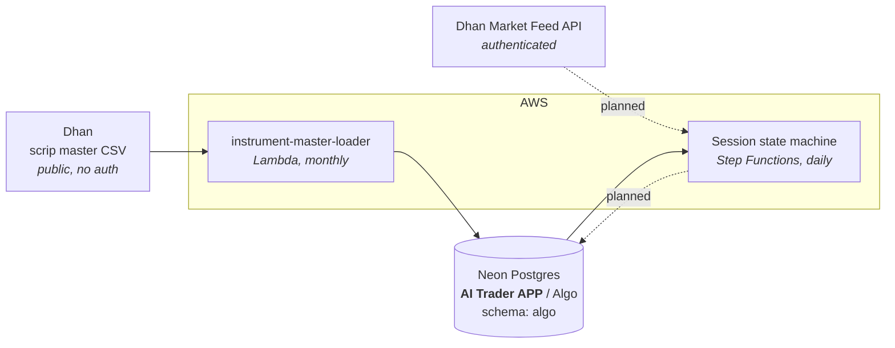

# Architecture

← [Back to root README](../README.md) · [Flow charts](flow.md) · [Components](components.md)

## System context

This repo is the **data layer** of an Indian-index algo trading system, rebuilt
on AWS Lambda. It does not place orders. Its job is to keep a correct,
replayable picture of the market in Postgres so that the decision layers above
it have something deterministic to read.

Two planes run on different clocks and are deliberately **not** coupled:

| Plane | Cadence | Trigger | Status |
|---|---|---|---|
| Instrument master refresh | monthly | EventBridge Scheduler cron | **built** |
| Session state machine | per trading day | EventBridge → Step Functions | planned |

## Why the loader sits outside the state machine

The instrument master is reference data, not session data. It changes when the
exchange lists or expires contracts — roughly monthly — while the state machine
runs per trading day. Coupling them would mean either re-fetching a 25 MB CSV
every morning or letting a slow, rarely-needed step sit on the critical path of
every session.

The monthly cadence is inherited from `should_load_instrument_master()` in the
legacy `trading-algo/data/database_service.py`, which reloads whenever no row
carries `updated_at >=` the first of the current month.

## Data store

**Neon project `AI Trader APP`** (`nameless-mountain-15353651`), database
`Algo`, schema `algo`. Neon is serverless Postgres — the compute autosuspends
when idle, which is a good fit for workloads that run monthly or once a day, at
the cost of a wake-up on the first connection of each run.

| Table | Shape | Rows | Written by |
|---|---|---|---|
| `instrument_master` | `security_id, trading_symbol, exchange_segment, instrument_type, lot_units, updated_at` | 15,338 | instrument-master-loader |
| `candle_5min` | `security_id, instrument_type, candle_ts, open, high, low, close, volume` | 0 | history task *(planned)* |
| `candle_15min` | same | 0 | history task *(planned)* |
| `candle_1hr` | same | 0 | history task *(planned)* |
| `candle_daily` | same | 0 | history task *(planned)* |

Row counts as of 2026-09-09. The candle tables exist but nothing writes to them
yet.

## Invariants

These hold across the whole system and are the reason it is built this way.

1. **Every time value is epoch seconds.** `updated_at`, `candle_ts`, and every
   timestamp added later. No `timestamptz` columns, no timezone arithmetic in
   SQL. Display conversion to IST happens at the edge, never in storage.
2. **`exchange_segment` is the raw Dhan segment code** — `NSE_EQ`, `IDX_I`,
   `NSE_FNO`, `BSE_FNO` — never a human-readable string. Downstream code passes
   it straight back to the broker API.
3. **`(security_id, instrument_type)` identifies an instrument.** It is the
   primary key of `instrument_master` and the join key used by the candle
   tables. `security_id` is `text`, not an integer, deliberately.
4. **The trading system is fully deterministic and replayable.** Given the same
   stored data it reaches the same decisions. Any LLM in the loop reads from
   this store and never writes a decision into it.

## Deployment shape

Everything is a **zip-packaged Lambda with a pure-Python layer** — no container
images, no Docker build.

An earlier iteration moved to containerised ECS Fargate tasks on the grounds
that pandas, psycopg2 and the `dhanhq` SDK do not fit Lambda's packaging
limits. That was abandoned: the packages turned out to be avoidable rather than
mandatory. The scrip master is a public CSV parseable with stdlib `csv`, and
[pg8000](../layers/neon-db-driver/README.md) is a pure-Python Postgres driver.
Dropping those three dependencies removed the reason to leave Lambda.

The rule that keeps it that way: **no compiled dependencies**. Anything needing
a C extension either gets replaced with a pure-Python equivalent or forces a
rethink of that component.
