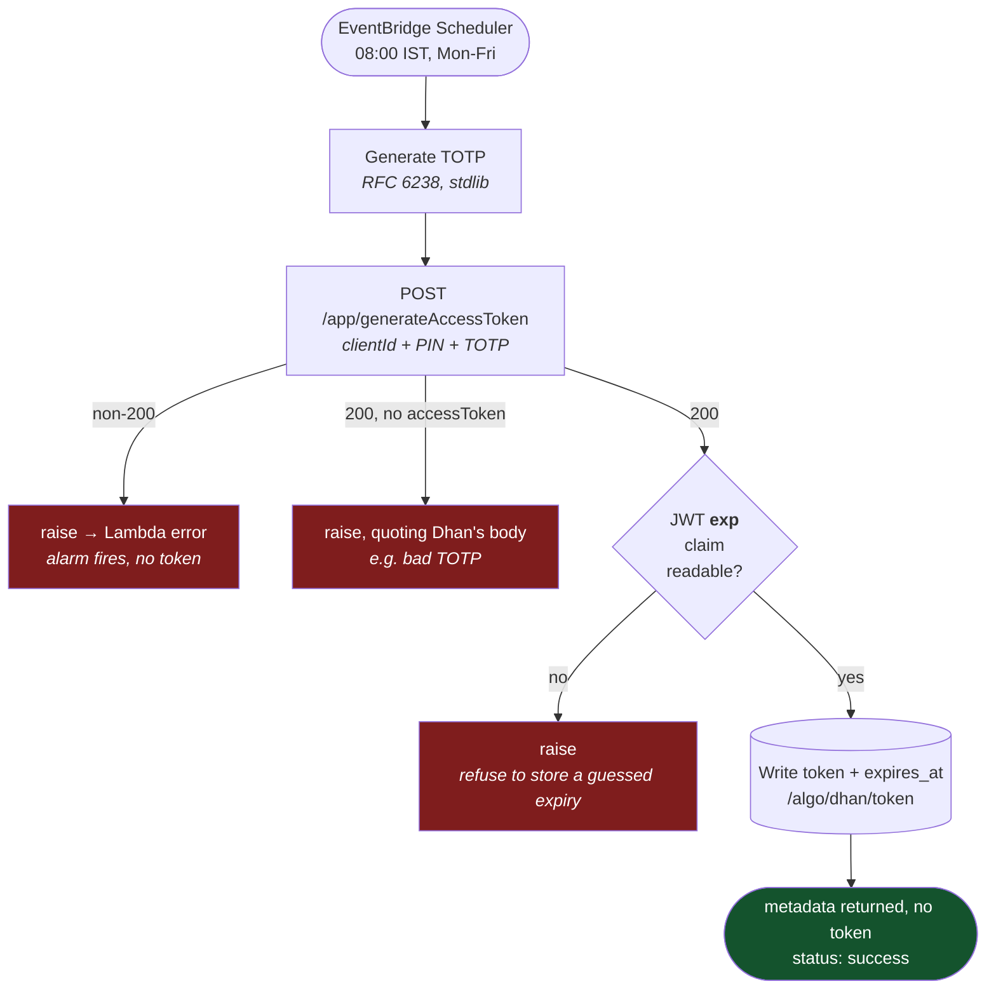
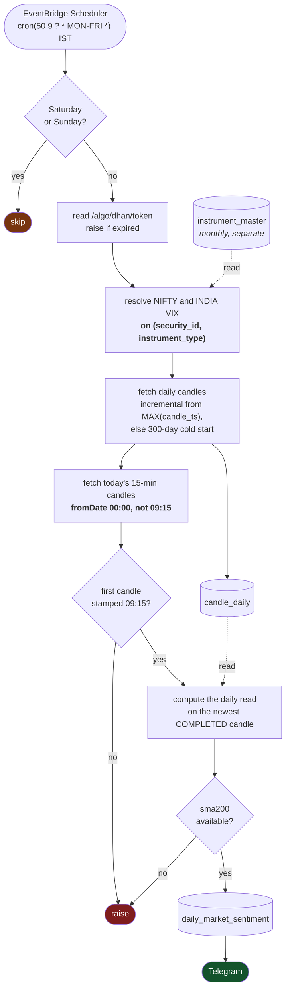

# Flow charts

← [Back to root README](../README.md) · [Architecture](architecture.md) · [Components](components.md)

## Instrument master refresh — monthly

The only flow that is fully built today. Runs on an EventBridge Scheduler cron,
independent of any trading session.

**Why the whole load commits once.** A partially written instrument master is
worse than a stale one: downstream lookups would silently miss contracts rather
than fail loudly, and the monthly cadence check would see fresh `updated_at`
values and decline to retry.

**Why failures raise instead of returning a status code.** Returning
`{"statusCode": 500}` makes Lambda record the invocation as a success — no
error metric, no alarm, no retry. On a job that runs twelve times a year, a
swallowed failure is one you discover from a bad trade.

### Numbers from the last run

Measured 2026-09-09, against the live scrip master and the live database.

| Stage | Value |
|---|---|
| CSV downloaded | 25.4 MB, 201,666 rows, 16 columns |
| Survive exchange gate | 127,042 |
| Match a rule | 15,338 |
| Written | 15,338 — 120 `IDX_I`, 2,675 `NSE_EQ`, 12,543 `NSE_FNO` |
| Upsert statements | 3 |

## Broker token refresh — each weekday morning

Runs on its own EventBridge Scheduler cron, `cron(0 8 ? * MON-FRI *)` in
`Asia/Kolkata`. Independent of the trading session.

**Why there is no renew step.** `/v2/RenewToken` would have let one TOTP login
carry a whole week, but it refuses tokens minted this way — `HTTP 500 DH-905
INVALID_REQUEST "Renewal of token not allowed for this token type"`, measured
2026-09-10. Renewal is offered only for tokens generated by hand from Dhan Web,
and seeding from the portal does not help: the chain breaks every weekend and
Monday's TOTP token is itself unrenewable. The branch was built, tested against
the live API, and deleted.

**Why one run a day is enough.** A token lives exactly 24 hours, so 08:00
covers the 09:15–15:30 session several times over. An earlier design ran every
12 hours purely to give the renew a margin it turned out not to need.

**Why an unreadable expiry raises.** `expires_at` is what consumers key their
freshness check off. A guessed value would keep a dead token in circulation
with nothing reporting it — the same class of silent wrongness as a 0-row load.

**Why the response carries no token.** It would only have served an on-demand
invoke that cannot fire in practice, and it put a live credential on the
console Test screen.

## Daily read — each weekday at 09:50

Three things in that diagram are load-bearing and each was learned the hard way:

**Resolve on the pair.** `security_id` alone is not unique — 19 of them carry
more than one `instrument_type`, and `13` is both NIFTY and ABB. The lookup
raises unless exactly one row matches.

**`fromDate 00:00`, not `09:15`.** `fromDate` is exclusive, so starting at the
session open silently drops the 09:15 candle — which *is* the opening range.
The explicit stamp check turns that into a loud failure.

**The read describes yesterday.** Dhan's daily endpoint lags a session, so at
09:50 the newest stored daily candle is the previous session's. Today's open
comes from the intraday call instead.

There is no holiday gate. On a holiday the fetch returns nothing new and the
sentiment row is simply not written — a calendar would be a second source of
truth to keep correct.

## Failure handling

| Failure | Detected by | Result |
|---|---|---|
| Dhan renames a CSV column | column presence check | raise — no silent 0-row load |
| CSV unreachable / slow | 120 s download timeout | raise |
| Duplicate PK inside a batch | dedupe before batching | prevented |
| Any batch rejected | `ROLLBACK`, then raise | nothing committed |
| Neon compute suspended | — | first `connect()` absorbs the wake-up |
| TOTP generation fails | non-200 from `/app/generateAccessToken` | raise — no token exists |
| Dhan refuses with a 200 envelope | no `accessToken` in body | raise, quoting the body |
| Token JWT has no `exp` claim | claim check before write | raise — nothing stored |
| Dhan token expired | `expires_at` check before any call | raise — never call with a dead token |
| `security_id` matches 0 or 2+ rows | exactly-one check in `resolve_instrument` | raise — no silent wrong instrument |
| Opening candle missing | first 15-min candle stamped ≠ 09:15 | raise — opening range would be wrong |
| Fewer than 200 daily candles | `sma200 is None` before classifying | raise, and `NOT NULL` in the schema |
| Chart arrays disagree in length | per-field length check in `to_candles` | raise |
| Dhan rate limit `DH-904` | retry with exponential backoff, then raise | — |
| Stray post-close candles | 09:15–15:30 session filter | dropped |
