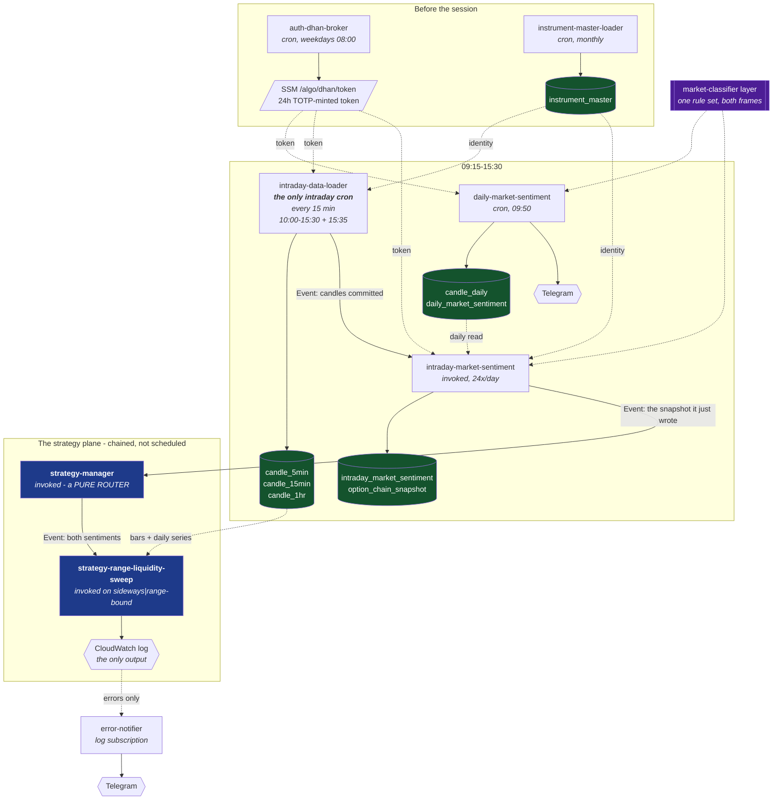
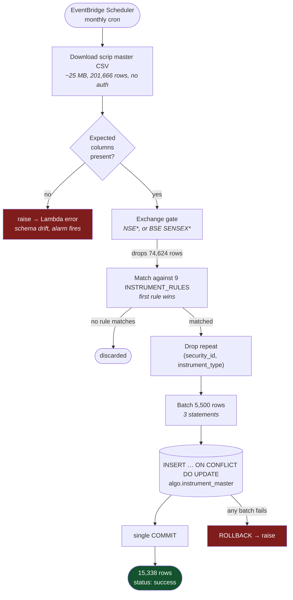
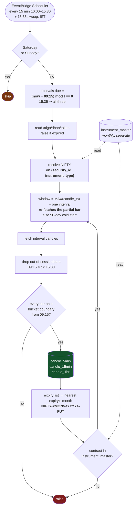
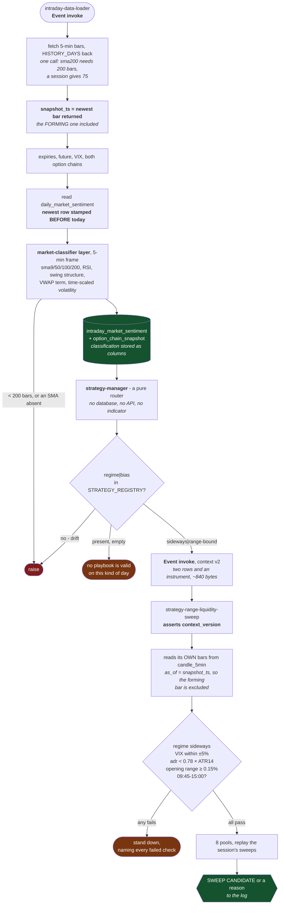
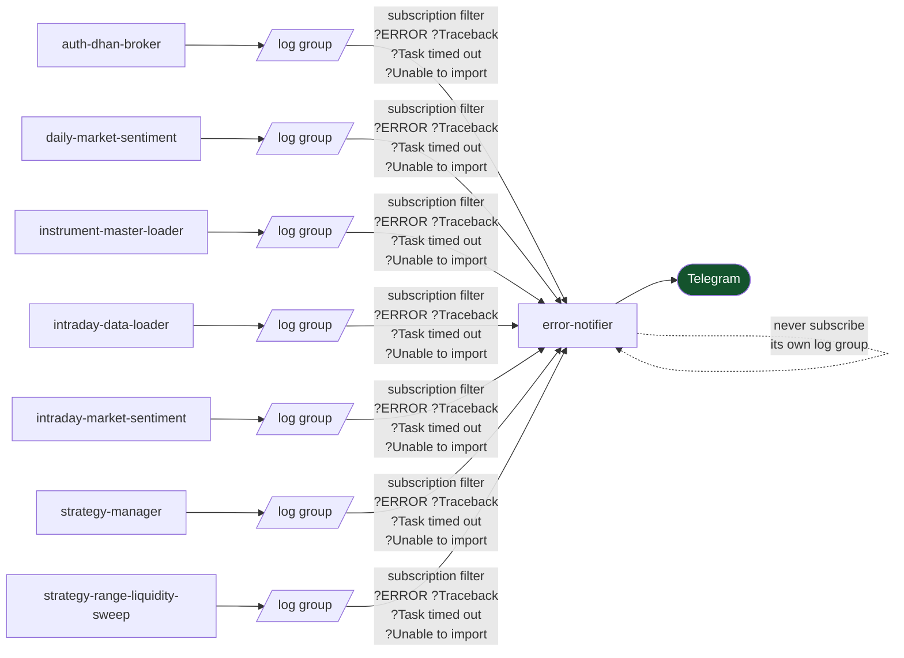

# Flow charts

← [Back to root README](../README.md) · [Architecture](architecture.md) · [Components](components.md)

## A trading day, end to end

Everything below this section is one plane in detail. This is the order they
actually happen in, and what hands off to what.

Read in clock order, a weekday looks like this:

| Time (IST) | What runs | Trigger | Writes |
|---|---|---|---|
| monthly | `instrument-master-loader` | cron | `instrument_master` |
| 08:00 | `auth-dhan-broker` | cron | `/algo/dhan/token` |
| 09:50 | `daily-market-sentiment` | cron | `candle_daily`, `daily_market_sentiment`, Telegram |
| 10:00–15:30 every 15 min, + 15:35 | `intraday-data-loader` | **cron** | the three candle tables |
| immediately after each of those 24 runs | `intraday-market-sentiment` | **invoke** | `intraday_market_sentiment`, `option_chain_snapshot` |
| immediately after | `strategy-manager` | **invoke** | nothing |
| immediately after, on an allowed regime/bias | `strategy-range-liquidity-sweep` | **invoke** | nothing |
| on failure only | `error-notifier` | log subscription | Telegram |

**Four schedules in total, and only one of them is intraday.**
`instrument-master-loader` monthly, `auth-dhan-broker` at 08:00,
`daily-market-sentiment` at 09:50, and `intraday-data-loader` every 15 minutes.
Everything else in the session is chained: the loader commits and invokes the
sentiment function, which writes its row and invokes the manager, which routes.

**Why chained rather than four crons.** Each step's input *is* the previous
step's output. A cron on the sentiment function would have to guess how long
the loader takes; a cron on the manager would have to read the snapshot back
out of Postgres and decide what to do when it is not there yet. The completion
of the write is the only honest trigger, so it is the trigger.

**Nothing in the chain can fail its caller.** Every invoke is `Event`, so
`intraday-market-sentiment` finishing is not a claim that the manager
succeeded, and the manager finishing is not a claim that any playbook did. Each
function has its own log group and `error-notifier` reports from all of them.

**The strategy plane writes nothing at all.** The regime the manager classifies
travels in the invocation payload and the playbook records it in its own log
beside whatever it found, so the decision is recoverable from the consumer
rather than duplicated into a table by the producer.

## Instrument master refresh — monthly

Runs on an EventBridge Scheduler cron, independent of any trading session.

**Why the whole load commits once.** A partially written instrument master is
worse than a stale one: downstream lookups would silently miss contracts rather
than fail loudly, and the monthly cadence check would see fresh `updated_at`
values and decline to retry.

**Why failures raise instead of returning a status code.** Returning
`{"statusCode": 500}` makes Lambda record the invocation as a success — no
error metric, no alarm, no retry. On a job that runs twelve times a year, a
swallowed failure is one you discover from a bad trade.

### Numbers from the last run

Measured 2026-09-09, against the live scrip master and the live database.

| Stage | Value |
|---|---|
| CSV downloaded | 25.4 MB, 201,666 rows, 16 columns |
| Survive exchange gate | 127,042 |
| Match a rule | 15,338 |
| Written | 15,338 — 120 `IDX_I`, 2,675 `NSE_EQ`, 12,543 `NSE_FNO` |
| Upsert statements | 3 |

## Broker token refresh — each weekday morning

Runs on its own EventBridge Scheduler cron, `cron(0 8 ? * MON-FRI *)` in
`Asia/Kolkata`. Independent of the trading session.

**Why there is no renew step.** `/v2/RenewToken` would have let one TOTP login
carry a whole week, but it refuses tokens minted this way — `HTTP 500 DH-905
INVALID_REQUEST "Renewal of token not allowed for this token type"`, measured
2026-09-10. Renewal is offered only for tokens generated by hand from Dhan Web,
and seeding from the portal does not help: the chain breaks every weekend and
Monday's TOTP token is itself unrenewable. The branch was built, tested against
the live API, and deleted.

**Why one run a day is enough.** A token lives exactly 24 hours, so 08:00
covers the 09:15–15:30 session several times over. An earlier design ran every
12 hours purely to give the renew a margin it turned out not to need.

**Why an unreadable expiry raises.** `expires_at` is what consumers key their
freshness check off. A guessed value would keep a dead token in circulation
with nothing reporting it — the same class of silent wrongness as a 0-row load.

**Why the response carries no token.** It would only have served an on-demand
invoke that cannot fire in practice, and it put a live credential on the
console Test screen.

## Daily read — each weekday at 09:50

Three things in that diagram are load-bearing and each was learned the hard way:

**Resolve on the pair.** `security_id` alone is not unique — 19 of them carry
more than one `instrument_type`, and `13` is both NIFTY and ABB. The lookup
raises unless exactly one row matches.

**`fromDate 00:00`, not `09:15`.** `fromDate` is exclusive, so starting at the
session open silently drops the 09:15 candle — which *is* the opening range.
The explicit stamp check turns that into a loud failure.

**The read describes yesterday.** Dhan's daily endpoint lags a session, so at
09:50 the newest stored daily candle is the previous session's. Today's open
comes from the intraday call instead.

There is no holiday gate. On a holiday the fetch returns nothing new and the
sentiment row is simply not written — a calendar would be a second source of
truth to keep correct.

## Intraday candles — every 15 minutes, 10:00–15:35

Four things in that diagram are load-bearing:

**One rule picks the intervals.** Dhan's intraday buckets are session-aligned
from 09:15, not clock-aligned — measured, by shortening `toDate` until the
candle count changed. So a run fetches interval *I* exactly when `(now − 09:15)`
is a whole multiple of *I* minutes, and the hourly trigger times fall out of
that rather than being written down separately. `assert_alignment()` raises if
the data ever stops matching.

**The window steps back one interval.** `fromDate` is exclusive, so resuming
from the newest stored `candle_ts` would never re-fetch that bar — and that bar
may be partial. Stepping back one whole interval re-fetches exactly it.

**The 15:35 sweep is not optional.** At 15:30 the 15:25 five-minute, 15:15
fifteen-minute and 15:15 hourly bars have only just closed. Without a later run
they would stay partial in the database permanently.

**The index is stored before the future is resolved.** Resolving the future
costs an extra API call. If it fails, the exception still propagates — but the
index candles are already committed rather than lost alongside it.

There is no holiday gate, for the same reason as the daily read: on a holiday
the fetch returns nothing new and nothing is written.

## Snapshot, routing and the playbook — on each of the 24 loader runs

No schedule anywhere in this chain. `intraday-data-loader` commits its candles
and invokes `intraday-market-sentiment`; that writes its row and invokes
`strategy-manager`; that routes.

Six things in that diagram are load-bearing:

**`snapshot_ts` is the newest bar returned, forming one included.** At a 10:00
run the bucket stamped 10:00 has just opened, so the row is stamped 10:00 and
`spot` is the live price — and it joins directly to the `candle_5min` row the
loader completes at 10:15. At 15:30 there is no 15:30 bucket, so the day's last
snapshot is stamped 15:25 with no special case. What is genuinely partial —
that bar's own high, low and volume — is not read by anything.

**One classification, two frames.** `daily-market-sentiment` and
`intraday-market-sentiment` call the same `market-classifier` layer, so a daily
row and an intraday row are on one scale. They were not before: the daily path
ported `detect_market_regime` (±7 score, TREND/RANGE/TRANSITION) and the
intraday path a different legacy builder (±3, TREND/RANGE), and `regime` meant
two different things depending on which table you read it from. `max_score` is
stored because the frames are still not on one *total* — the 5-minute frame
carries a VWAP term the daily frame cannot.

**The daily lookup is "newest row before today", not "today's row".** A daily
row is stamped with the session it *describes*, which is yesterday, because
Dhan's daily endpoint lags. A row stamped today never exists. The previous
version of the manager looked it up with today's midnight and therefore always
got `None` — every playbook gating on the daily read was gating on nothing.
`stale` now says whether this morning's 09:50 run actually landed.

**The manager reads, computes and writes nothing.** The classification moved
*up* into the layer and is stored by the function that computes it; the data
fetch moved *down* into the playbooks. What is left is the routing decision.

**Routing is on `regime|bias`, and every cell is listed.** A key present and
mapping to `[]` is a deliberate "no playbook today"; a key *missing* means the
classifier and the registry have drifted apart, and that raises — routing
nothing would otherwise look exactly like a correct stand-down. Eight of the
nine cells are deliberately empty: which combinations run which playbook is a
decision to take against observed sessions, and there are none yet.

**The playbook fetches its own bars, from Neon, not Dhan.** The only thing the
manager ever called Dhan for was a live price, and this playbook never read it
— a sweep is confirmed by a *closed* bar reclaiming a level. Bounding the read
on `snapshot_ts` rather than the clock is what makes a re-run reach the same
answer rather than merely repeat.

## How a failure reaches you

Every row in the table below ends in a raised exception, which is the point:
raising is what makes Lambda record an error and write a traceback to the log.
A function returning a `{"statusCode": 500}` shape would count as a **success**
— no error metric, no log line worth matching, nothing to alert on. The "fail
loudly" rule is what makes the alerting below possible at all.

A log subscription rather than a `try/except` inside each function, because a
**timeout** kills the process before any `except` runs and an **import error**
fires before the handler module loads — the two failures least likely to be
noticed, and the two a catch block can never see. Both still reach the log.

`error-notifier`'s own log group is deliberately not subscribed: it would log,
trigger itself, and loop. The handler refuses payloads from its own log group so
the mistake is inert rather than expensive.

**Subscribing every log group is not optional for the chained plane.** The two
strategy functions are invoked asynchronously, so nothing upstream fails when
they do: `intraday-market-sentiment` returning success says only that its row
was written and the invoke was accepted. Their own log groups are the only
place their failures appear. An unsubscribed `strategy-manager` would stop
routing and no alarm would fire anywhere.

This compounds with the execution-role trap. A borrowed role allows
`logs:PutLogEvents` on one log group ARN only, so a function using it produces
**no logs at all** — and for `strategy-range-liquidity-sweep`, whose log *is*
its entire output, that means it produces nothing whatsoever while appearing to
succeed.

**Two gaps remain.** Nothing watches the notifier itself, and nothing detects
*silence* — a schedule that stops firing raises no error because nothing runs.
The chained plane widens that second gap: a manager that is never invoked, or
a playbook never dispatched because the registry lost its regime, is silent in
exactly the same way as a quiet market.

## Failure handling

| Failure | Detected by | Result |
|---|---|---|
| Dhan renames a CSV column | column presence check | raise — no silent 0-row load |
| CSV unreachable / slow | 120 s download timeout | raise |
| Duplicate PK inside a batch | dedupe before batching | prevented |
| Any batch rejected | `ROLLBACK`, then raise | nothing committed |
| Neon compute suspended | — | first `connect()` absorbs the wake-up |
| TOTP generation fails | non-200 from `/app/generateAccessToken` | raise — no token exists |
| Dhan refuses with a 200 envelope | no `accessToken` in body | raise, quoting the body |
| `intraday-data-loader` has stalled | the sentiment function fetches its own bars and never reads the loader's tables | cannot happen there; in the playbook a stale bar costs one scan the next run corrects |
| Fewer than 200 closed 5-min bars | `MIN_BARS_TO_CLASSIFY`, before the layer is called | raise — not a score capped at ±2 |
| An SMA absent on the newest bar | explicit `None` check in the layer | raise — never defaulted to `0.0` |
| the classifier and the registry drift apart | `regime\|bias` key absent from `STRATEGY_REGISTRY` | raise — not an empty shortlist |
| The dispatched context exceeds 256 KB | checked before `invoke` | raise, naming the two rows (a real one measures ~840 bytes) |
| A strategy invoke is refused | `StatusCode` / `FunctionError` | every invoke attempted, then one raise naming all failures |
| The manager's payload shape changes | `context_version` assertion in each strategy (now v2) | raise — never a gate passing on a vanished input |
| A strategy fails after dispatch | its own log group → `error-notifier` | reported from there; the manager cannot see it and does not claim to |
| The daily read is missing or stale | `stale` flag from `created_at`, set where the row is read | logged by both the reader and the router; playbooks stand down on their own gate |
| Token JWT has no `exp` claim | claim check before write | raise — nothing stored |
| Dhan token expired | `expires_at` check before any call | raise — never call with a dead token |
| `security_id` matches 0 or 2+ rows | exactly-one check in `resolve_instrument` | raise — no silent wrong instrument |
| Opening candle missing | first 15-min candle stamped ≠ 09:15 | raise — opening range would be wrong |
| Fewer than 200 daily candles | `sma200 is None` before classifying | raise, and `NOT NULL` in the schema |
| Chart arrays disagree in length | per-field length check in `to_candles` | raise |
| Dhan rate limit `DH-904` | retry with exponential backoff, then raise | — |
| Stray post-close candles | 09:15–15:30 session filter | dropped |
| Dhan changes interval alignment | every bar checked against the 09:15 origin | raise — the schedule no longer matches the data |
| Expiry list empty, or every date past | check before deriving the month | raise — cannot resolve the future |
| Futures contract absent from the master | exactly-one check in `resolve_by_symbol` | raise, naming the stale instrument master |
| No Dhan client id available | checked before the expiry call | raise |
| Candle table name not one of the three | whitelist check before any query | raise |
| Newest bar left partial at the close | the 15:35 closing sweep | prevented |
| Resume window exceeds Dhan's 90-day cap | clamped before the call | prevented |
