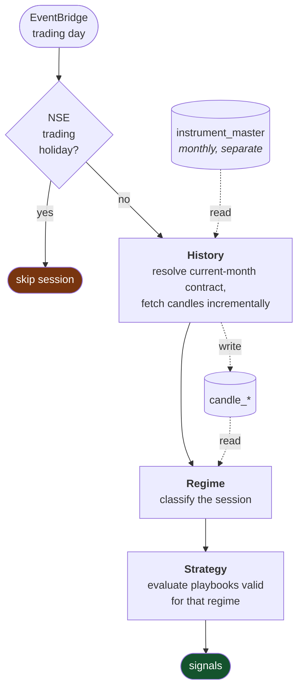

# Flow charts

← [Back to root README](../README.md) · [Architecture](architecture.md) · [Components](components.md)

## Instrument master refresh — monthly

The only flow that is fully built today. Runs on an EventBridge Scheduler cron,
independent of any trading session.

**Why the whole load commits once.** A partially written instrument master is
worse than a stale one: downstream lookups would silently miss contracts rather
than fail loudly, and the monthly cadence check would see fresh `updated_at`
values and decline to retry.

**Why failures raise instead of returning a status code.** Returning
`{"statusCode": 500}` makes Lambda record the invocation as a success — no
error metric, no alarm, no retry. On a job that runs twelve times a year, a
swallowed failure is one you discover from a bad trade.

### Numbers from the last run

Measured 2026-09-09, against the live scrip master and the live database.

| Stage | Value |
|---|---|
| CSV downloaded | 25.4 MB, 201,666 rows, 16 columns |
| Survive exchange gate | 127,042 |
| Match a rule | 15,338 |
| Written | 15,338 — 120 `IDX_I`, 2,675 `NSE_EQ`, 12,543 `NSE_FNO` |
| Upsert statements | 3 |

## Session state machine — daily *(planned)*

Not built. Recorded here so the loader's boundary is clear.

The ordering is a hard dependency chain: regime classification needs candles,
and strategy selection is only valid inside a known regime — running a
range-bound playbook on a trending day is the expensive failure mode this
sequencing exists to prevent.

## Failure handling

| Failure | Detected by | Result |
|---|---|---|
| Dhan renames a CSV column | column presence check | raise — no silent 0-row load |
| CSV unreachable / slow | 120 s download timeout | raise |
| Duplicate PK inside a batch | dedupe before batching | prevented |
| Any batch rejected | `ROLLBACK`, then raise | nothing committed |
| Neon compute suspended | — | first `connect()` absorbs the wake-up |
